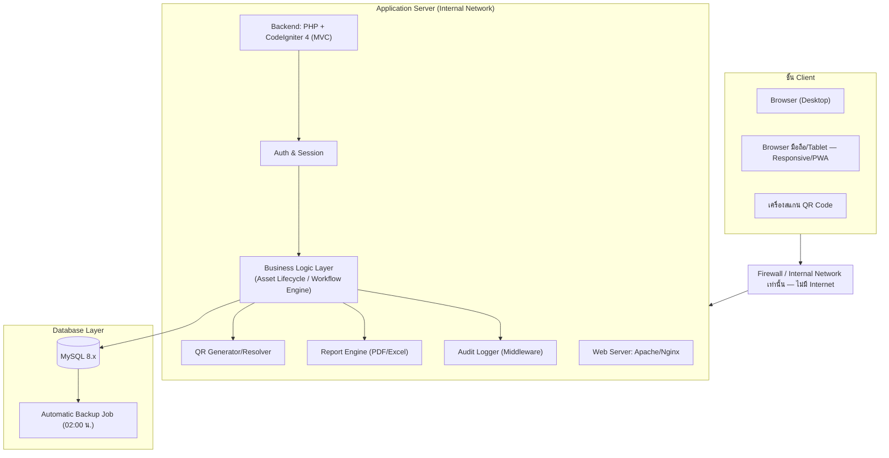
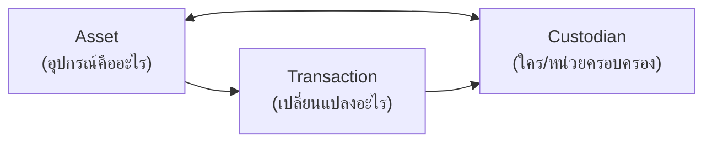
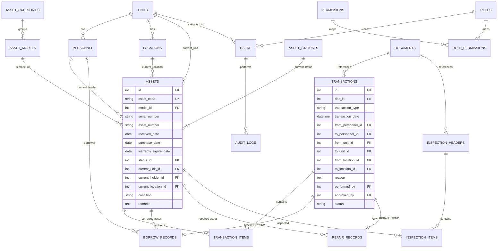
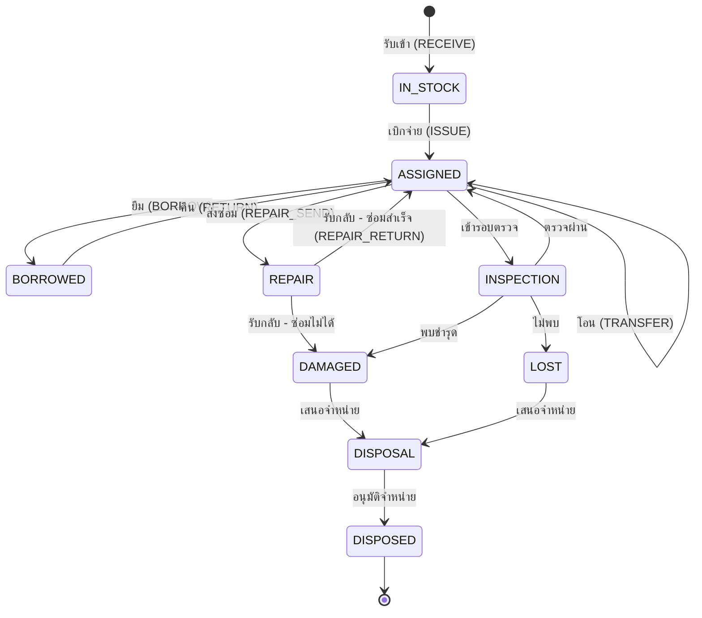
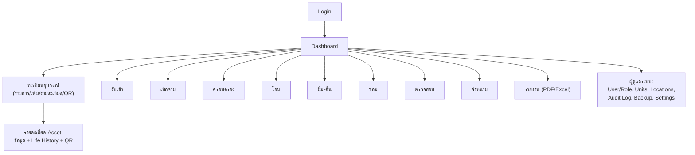

# Communication Asset Management System (CAMS)
### เอกสารออกแบบระบบ — Standalone V1
**สำหรับ:** RTAF RCC — ระบบควบคุมทะเบียนอุปกรณ์สื่อสาร
**สถานะเอกสาร:** Prototype / Technical Design (ต่อจาก Business Design ที่ได้ล็อกไว้แล้ว)

---

## 1. ภาพรวมสถาปัตยกรรม (Architecture Overview)

ระบบเป็น **Standalone 3-Tier Web Application** ทำงานภายในเครือข่ายหน่วยเท่านั้น ไม่เชื่อมต่อ Internet/Cloud/API ภายนอกตามข้อกำหนด



**หลักการออกแบบสำคัญ**: ทุก write-operation ต้องผ่าน **Workflow Engine** เดียว ที่บังคับ Business Rules (ข้อ 23 ของ requirement) และสร้าง `audit_logs` โดยอัตโนมัติผ่าน Middleware — ห้าม controller เขียนตรงลง table โดยไม่ผ่านชั้นนี้ เพื่อรับประกันว่าไม่มีการเปลี่ยนสถานะใดๆ หลุดการบันทึกประวัติ

---

## 2. แนวคิดข้อมูลหลัก (Domain Model)



Asset ไม่เคยถูกลบ (Soft lifecycle only) — สถานะสุดท้ายคือ `DISPOSED` ไม่ใช่การลบแถวข้อมูล

---

## 3. Entity Relationship Diagram (ครบ ~20 ตาราง)



รายละเอียดคอลัมน์ครบทั้งหมดอยู่ใน `database-schema.sql`

---

## 4. สถานะ Asset และการเปลี่ยนสถานะ (State Machine)



**Guard rules ที่ Workflow Engine ต้องบังคับ** (ตรง requirement ข้อ 23):
| จากสถานะ | ห้ามทำ action |
|---|---|
| DISPOSED | ISSUE, TRANSFER, BORROW ทุกกรณี |
| REPAIR | ISSUE |
| BORROWED | TRANSFER (ต้องคืนก่อน) |
| LOST | ทุก action ที่ทำให้ asset ถูกใช้งาน |
| Transaction.status = COMPLETED | แก้ไขข้อมูลใดๆ (ต้องออก transaction ใหม่แทน) |

---

## 5. Workflow ของแต่ละโมดูล

### 5.1 รับเข้า (RECEIVE)
`สร้างใบรับ → เพิ่มรายการ → ระบุ S/N → ตรวจรับ → สร้าง Asset Code → สร้าง QR → status=IN_STOCK`

### 5.2 เบิกจ่าย (ISSUE)
`สร้างใบเบิก → เลือกอุปกรณ์ → เสนอ → อนุมัติ (APPROVER) → จ่าย → ผู้รับยืนยัน → COMPLETED`
ผลลัพธ์: `IN_STOCK→ASSIGNED`, holder: คลัง→ผู้รับ, unit: คลัง→หน่วยผู้รับ

### 5.3 โอน (TRANSFER)
ต้องมี: เลขที่เอกสาร, วันที่, รายการ, เหตุผล, ผู้ส่ง, ผู้รับ, ผู้อนุมัติ → เปลี่ยน current holder เมื่อ COMPLETED เท่านั้น

### 5.4 ยืม–คืน (BORROW/RETURN)
เก็บ: ผู้ยืม, วันที่ยืม, กำหนดคืน, วันที่คืน, สภาพตอนคืน, ผู้อนุมัติ
Background Job ตรวจทุกวัน: ถ้า `due_date < today AND return_date IS NULL` → status=`OVERDUE` + แจ้งเตือน Dashboard

### 5.5 ซ่อม (REPAIR)
`พบชำรุด → แจ้งซ่อม → ตรวจสอบ → อนุมัติ → ส่งซ่อม → ซ่อม → รับกลับ → ตรวจรับ → กลับใช้งาน`
เก็บ: อาการเสีย, ผลตรวจ, วันส่ง, หน่วย/สถานที่ซ่อม, ค่าใช้จ่าย, วันรับกลับ, ผลการซ่อม

### 5.6 ตรวจสอบ (INSPECTION)
สร้างรอบตรวจ → รายการต่อ asset (พบ/ไม่พบ, สภาพ, ที่ถูกต้อง, ผู้ครอบครองถูกต้อง) → สรุปยอดอัตโนมัติ

### 5.7 จำหน่าย (DISPOSAL)
`ASSIGNED/DAMAGED/LOST → DISPOSAL → DISPOSED` — **ห้าม DELETE** เก็บ record ตลอดไปเพื่อ Life History

---

## 6. Role & Permission Matrix

| โมดูล | SUPER ADMIN | UNIT ADMIN | OFFICER | APPROVER | VIEWER |
|---|---|---|---|---|---|
| จัดการ User/Role | CRUD | - | - | - | - |
| ทะเบียนอุปกรณ์ | CRUD | CRUD (หน่วยตน) | Create/Edit | - | View |
| รับเข้า/เบิก/โอน/ยืม/ซ่อม/ตรวจ | CRUD | CRUD (หน่วยตน) | Create/Edit | - | View |
| อนุมัติรายการ | ✓ | ✓ (หน่วยตน) | - | ✓ | - |
| จำหน่าย | ✓ | เสนอ | เสนอ | อนุมัติ | View |
| รายงาน | ✓ | หน่วยตน | หน่วยตน | หน่วยตน | View |
| Audit Log | View ทั้งหมด | View หน่วยตน | - | - | - |
| Backup/System Settings | ✓ | - | - | - | - |

สิทธิ์จริงกำหนดผ่านตาราง `role_permissions` (configurable) — ตารางนี้คือ default ตั้งต้น

---

## 7. โครงสร้างหน้าจอ (Screen Map)



---

## 8. REST API Design (สรุปตาม Module)

```
Auth
  POST   /api/auth/login
  POST   /api/auth/logout

Master Data
  GET/POST/PUT      /api/units
  GET/POST/PUT      /api/personnel
  GET/POST/PUT      /api/locations
  GET/POST/PUT      /api/asset-categories
  GET/POST/PUT      /api/asset-models
  GET/PUT           /api/asset-statuses   (แก้ชื่อสถานะได้โดย Admin)

Assets
  GET    /api/assets                 ?status=&unit=&holder=&q=
  GET    /api/assets/{code}
  GET    /api/assets/{code}/history   → life history เต็มรูปแบบ
  GET    /api/assets/{code}/qr        → คืนภาพ QR

Transactions (แต่ละ endpoint สร้าง Document + Transaction + Transaction_items)
  POST   /api/receive
  POST   /api/issue
  POST   /api/transfer
  POST   /api/borrow
  POST   /api/borrow/{id}/return
  POST   /api/repair/send
  POST   /api/repair/{id}/return
  POST   /api/disposal

Inspection
  POST   /api/inspections
  POST   /api/inspections/{id}/items
  POST   /api/inspections/{id}/close

Approval (ใช้ร่วมกันทุก transaction type ที่ต้องอนุมัติ)
  POST   /api/approvals/{transaction_id}/approve
  POST   /api/approvals/{transaction_id}/reject

Reports
  GET    /api/reports/registry            (ตามหน่วย/ผู้ครอบครอง)
  GET    /api/reports/{type}?format=pdf|xlsx
         type = receive|issue|transfer|borrow|repair|damaged|inspection|lost|disposal-pending|disposal|asset-history

Dashboard
  GET    /api/dashboard/summary
  GET    /api/dashboard/alerts            (overdue, ค้างซ่อม, ยังไม่ตรวจ, ไม่พบ)

Admin
  GET/POST/PUT   /api/users
  GET/POST/PUT   /api/roles
  GET            /api/audit-logs          ?user=&table=&date=
  GET            /api/backups
  POST           /api/backups/run
```

ทุก endpoint ที่เป็น write-operation ต้อง**ผ่าน Workflow Engine ชั้นเดียวกัน** และบันทึก audit log อัตโนมัติ (WHO+WHEN+WHAT+WHY+DOCUMENT ตามข้อ 23)

---

## 9. Non-functional Requirements

| หัวข้อ | แนวทาง |
|---|---|
| Security | Password hash (bcrypt/argon2), Session timeout, Role-based access, จำกัดสิทธิ์ตามหน่วย |
| Audit | Log ทุก action สำคัญ, ห้าม user ลบ audit log |
| Backup | Automatic 02:00 น. ทุกวัน, เก็บย้อนหลัง 30 วัน, มีหน้าประวัติ backup พร้อมสถานะ SUCCESS/FAILED |
| Availability | Internal server เท่านั้น ไม่พึ่ง Internet |
| Mobile | Responsive Web / PWA รองรับกล้องสแกน QR ผ่าน browser (ไม่ต้องทำ native app ใน V1) |
| Performance | Index บน asset_code, serial_number, status_id, current_unit_id สำหรับการค้นหา |

---

## 10. เทคโนโลยี (ตามที่ระบุในเอกสาร requirement)

| ชั้น | เทคโนโลยี |
|---|---|
| Frontend | Bootstrap 5 + Vanilla JS (Responsive/PWA) |
| Backend | PHP 8 + CodeIgniter 4 (MVC) |
| Database | MySQL 8 |
| Server | Local/Internal Server |
| QR | QR Code Generator (server-side) + Scanner (browser camera API) |

---

## 11. สิ่งที่ยังไม่ฟันธง (รอเอกสารจริงของหน่วย)

ตามที่ระบุไว้ท้าย requirement เดิม รายการต่อไปนี้ใน design นี้เป็น**ค่าตั้งต้นที่ปรับได้** ไม่ใช่ค่าตายตัว รอเทียบกับระเบียบ ทอ. ฉบับที่หน่วยใช้จริงก่อน finalize:
- ชื่อสถานะ Asset (`asset_statuses` เป็นตาราง configurable ไว้แล้ว)
- คำเรียกทางราชการของแต่ละเอกสาร/ใบ
- ลำดับชั้นการอนุมัติ (ตอนนี้ทำเป็น single-approver, ขยายเป็น multi-level ได้ถ้าจำเป็น)
- ผู้มีอำนาจอนุมัติแต่ละกระบวนการ (กำหนดผ่าน `role_permissions`)

---

## 12. ขั้นต่อไป

1. รีวิว ER Diagram + Schema กับผู้ใช้งานจริงของ RTAF RCC
2. ตรวจสอบ Role/Approval flow กับระเบียบจริง
3. Build Prototype UI (แนบมาพร้อมเอกสารนี้ — `CAMS-Prototype.html`) เพื่อทดสอบ UX ก่อนลง Code จริง
4. เข้าสู่ Development phase (CodeIgniter 4 + MySQL) ตาม schema/API design นี้
